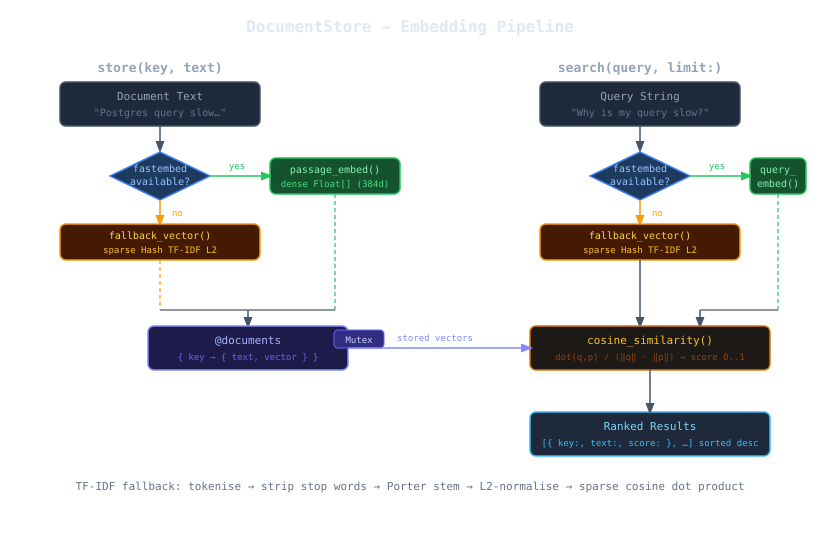

# How It Works

## Architecture Overview



Two operations drive the store: **`store`** (embed and save) and **`search`** (embed and rank). Both paths share the same embedding backend — fastembed when available, TF-IDF otherwise.

---

## Embedding Backend Selection

On load, `DocumentStore` attempts to `require 'fastembed'`. The result is captured in `FASTEMBED_AVAILABLE` and drives every subsequent embed call. There is no runtime switching — the backend is fixed for the lifetime of the object.

```
require 'fastembed'
  → success  : FASTEMBED_AVAILABLE = true   → dense vector path
  → LoadError: FASTEMBED_AVAILABLE = false  → TF-IDF fallback path
```

---

## Fastembed Path — Dense Vectors

When fastembed is available, the store uses [BAAI/bge-small-en-v1.5](https://huggingface.co/BAAI/bge-small-en-v1.5) by default — a 33M parameter English bi-encoder that produces 384-dimensional float vectors.

### Asymmetric Embedding

The model uses **separate encoders** for passages (stored documents) and queries (search terms). This is deliberate: a passage encoder is optimised to capture what a document *contains*, while a query encoder is optimised to capture what a user *wants*. Using the same encoder for both degrades recall on semantically paraphrased queries.

| Call | Encoder used | Purpose |
|------|-------------|---------|
| `store(key, text)` | `passage_embed` | Captures document content |
| `search(query)` | `query_embed` | Captures search intent |

### Cosine Similarity

Given a query vector **q** and a stored passage vector **p**, similarity is:

```
similarity = dot(q, p) / (‖q‖ · ‖p‖)
```

This is the cosine of the angle between the vectors. A value of `1.0` means identical
direction (maximum similarity); `0.0` means orthogonal (no relationship). The
BGE model normalises its output to unit length, so the division reduces to a simple
dot product — but `DocumentStore` performs explicit normalisation anyway to remain
correct regardless of the model used.

**Defensive guards** return `0.0` for nil vectors, empty vectors, or length mismatches.
These protect against partial or corrupted embed results without raising exceptions.

---

## TF-IDF Fallback Path — Sparse Vectors

When fastembed is unavailable, each document is converted to a sparse
`Hash{String => Float}` where keys are stemmed terms and values are L2-normalised
term frequencies.

### Processing Pipeline

```
raw text
  → downcase
  → tokenise /[a-z]+/   (ASCII only — Unicode letters are dropped)
  → remove STOP_WORDS   (45 common English words: a, an, the, is, are, …)
  → Porter-style stem   (strips: -ies, -ness, -ment, -tion, -ing, -ed, -er, -ly, -s)
  → count term frequencies
  → L2-normalise counts  (divide each count by the Euclidean norm of the count vector)
```

The result is a unit-length sparse vector. Similarity between two sparse vectors
uses the same cosine formula, but computed efficiently by iterating only over the
keys present in the smaller vector.

### Stemmer

The stemmer applies suffix rules in priority order and stops at the first match:

| Rule | Example |
|------|---------|
| `-ies` → `-y` | `activities` → `activiti` |
| `-ness` → `` | `darkness` → `dark` |
| `-ment` → `` | `development` → `develop` |
| `-tion` → `` | `configuration` → `configura` |
| `-ing` → `` | `running` → `runn` |
| `-ed` → `` | `deployed` → `deploy` |
| `-er` → `` | `server` → `serv` |
| `-ly` → `` | `quickly` → `quick` |
| `-s` → `` | `robots` → `robot` |

This is intentionally simple — not a full Porter stemmer. Its purpose is to improve
lexical recall during development and testing, not to rival production semantic search.

### Limitations of the Fallback

- **No semantic understanding** — synonyms, paraphrases, and cross-lingual queries will not match
- **ASCII only** — non-ASCII characters (accented letters, CJK, emoji) are silently dropped
- **Order-insensitive** — "connection pool exhausted" and "exhausted pool connection" score identically

For any production use case, install fastembed.

---

## Thread Safety

All public methods acquire an internal `Mutex` before touching `@documents`.
Embedding (which can be slow — tens of milliseconds for the first call) happens
**outside** the lock to avoid blocking concurrent readers.

```ruby
def store(key, text)
  key    = key.to_sym
  vector = passage_vector(text)          # ← compute outside the lock
  @mutex.synchronize do
    @documents[key] = { text:, vector: } # ← write inside the lock
  end
  self
end
```

This means multiple threads can embed documents concurrently. The lock only
serialises the final hash write and all reads.

---

## RobotLab Extension Registration

The file bottom contains:

```ruby
if defined?(RobotLab) && RobotLab.respond_to?(:register_extension)
  RobotLab.register_extension(:document_store, RobotLab::DocumentStore)
end
```

This registers the class with robot_lab core when both gems are loaded together,
enabling `Memory#store_document`, `Memory#search_documents`, and `Memory#document_keys`
on any `RobotLab::Memory` instance. The guard makes the file safe to `require`
standalone without robot_lab present.
